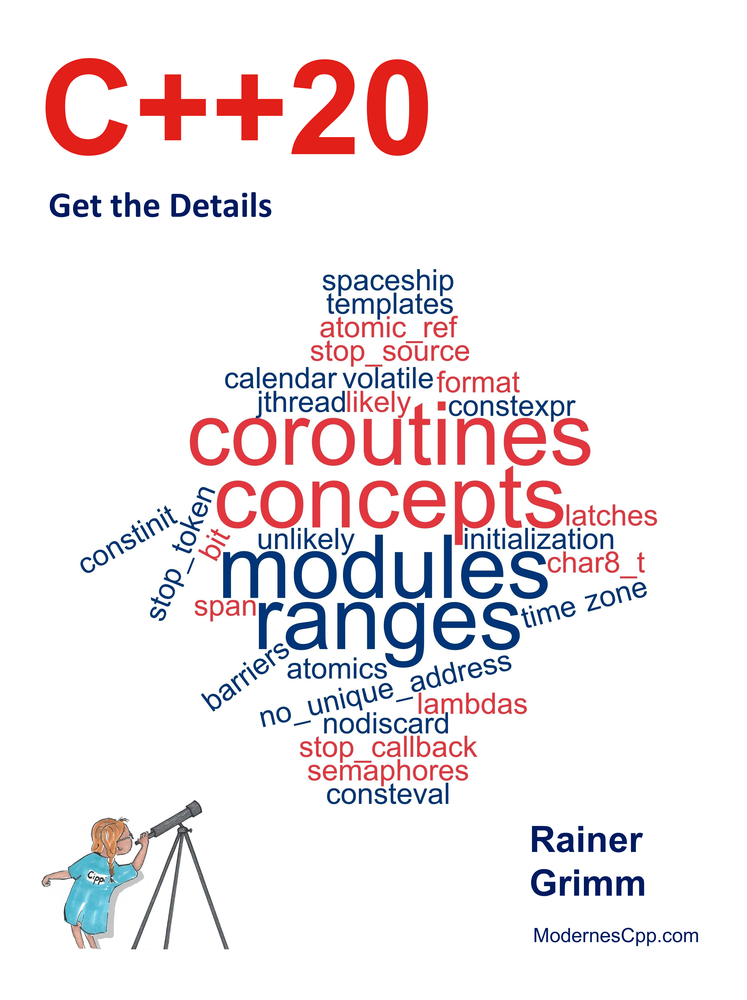

# C++20

*Get the Details* 

* 作者：Rainer Grimm 
* 译者：陈晓伟
* 首次发布时间：2021年4月20日([来源](https://www.amazon.com/C-20-Details-Rainer-Grimm/dp/B09328NKXK))

> 翻译是译者用自己的思想，换一种语言，对原作者想法的重新阐释。鉴于我的学识所限，误解和错译在所难免。如果你能买到本书的原版，且有能力阅读英文，请直接去读原文。因为与之相较，我的译文可能根本不值得一读。
>
> 
 — 云风，程序员修炼之道第2版译者

PDF可在本库的[Release页面](https://github.com/xiaoweiChen/CXX20-Get-Details/releases)获取。

## 本书概述

这本书既是C++20标准的教程，也是C++20标准的参考资料。会教你如何使用C++20，并提供新C++标准的细节。这里最主要是C++20的四大特性。

概念(Concept)改变了思考和编程模板的方式，是模板参数的语义类别，可在类型系统中直接表达意图。若出现错误，将出现一条明确的错误信息。

新的“范围”库(ranges library)，能够直接在容器上执行算法，用管道符号组合算法，并可应用到无限数据流上。

因为协程(coroutines)，C++中的异步编程成为主流。协程是协作任务、事件循环、无限数据流或管道的基础。

模块(Modules)克服了头文件的限制，例如：头文件和源文件的分离和预处理器一样过时。最后，可以享受更快的构建时间和更简单的构建包方法。

#### 将会了解

- 自动生成的比较运算符

- 日期和时区库

- 格式库

- 连续的内存块

- 加强版可中断线程

- 原子智能指针

- 信号量

- 协调原语，如锁存和栅栏

## 如何阅读

若不熟悉C++20，请从本书的第一部分开始了解。

当有了一定的了解，就可以继续研究核心语言了。每个特性是独立的，但推荐从头到尾阅读这本书。第一次阅读时，可以跳过概述章节中没有提到的特性。

## 作者简介

**Rainer Grimm**自1999年以来一直担任软件架构师、团队领导和讲师。2002年，为公司的进一步教育组织了实习生会议。从2002年起，就开始开设培训课程，第一个教程是关于专有管理软件的，但不久之后开始教授Python和C++。在业余时间，喜欢写关于C++，Python和Haskell的文章，也喜欢在会议上发言。每周都会在英语博客[Modernes Cpp](https://www.modernescpp.com/  )和由[German blog](https://www.grimm-jaud.de/index.php/blog  )主办的德语博客上发表文章。

自2016年以来，其一直是一名独立讲师，讲授现代C++和Python的研讨会。可以用不同的语言出版了几本关于现代C++的书，特别是关于**并发性**的技术书籍。由于其职业素养，一直在寻找教授现代C++的最佳方法。

## 致谢

我开始在我的英文博客[ModernesCpp](http://www.modernescpp.com  )上邀请大家进行校对，收到的回复比预期的要多。感谢你们所有人，包括我闺女朱丽叶。

以下是校对人员的名字，按字母顺序排列: Bob Bird, Nicola Bombace, Dave Burchill, Sandor Dargo, James Drobina, Frank Grimm, Kilian Henneberger, Ivan “espkk” Kondakov, Péter Kardos, Rakesh Mane, Jonathan O’Connor, John Plaice, Iwan Smith, Peter Sommerlad, Paul Targosz, Steve Vinoski, and Greg Wagner。

## 本书相关

* github地址：https://github.com/xiaoweiChen/CXX20-Get-Details
* 译文的LaTeX 环境配置：https://www.cnblogs.com/1625--H/p/11524968.html 
  * 禁用拼写检查：https://blog.csdn.net/weixin_39278265/article/details/87931348

* vscode中配置latex：https://blog.csdn.net/Ruins_LEE/article/details/123555016
* 原书示例：https://github.com/RainerGrimm/Cpp20

